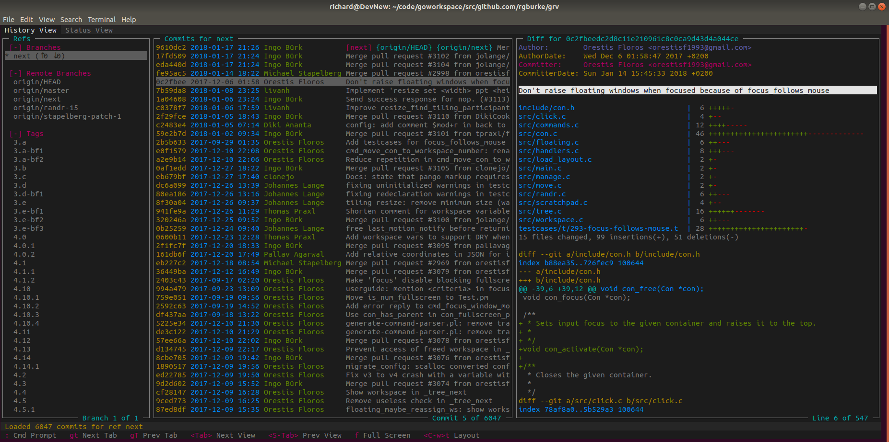

# GRV - Git Repository Viewer [](https://travis-ci.org/rgburke/grv)

GRV is a terminal based interface for viewing Git repositories. It allows
refs, commits and diffs to be viewed, searched and filtered. The behaviour
and style can be customised through configuration. A query language can
be used to filter refs and commits, see the [Documentation](#documentation)
section for more information.



More screenshots can be seen [here](doc/screenshots.md)

## Features

 - Commits and refs can be filtered using a query language.
 - Changes to the repository are captured by monitoring the filesystem allowing the UI to be updated automatically.
 - Organised as tabs and splits. Custom tabs and splits can be created using any combination of views.
 - Vi like keybindings by default, key bindings can be customised.
 - Custom themes can be created.
 - Mouse support.
 - Commit Graph.

## Documentation

Documentation for GRV is available [here](doc/documentation.md)

## Install

**Note:** `grv` is currently an alias used by oh-my-zsh. Add `unalias grv` to the end of your `.zshrc` to invoke GRV.

### Linux

Static binaries are available for Linux. For example, to use
the amd64 binary run the following steps:

```
wget -O grv https://github.com/rgburke/grv/releases/download/v0.3.2/grv_v0.3.2_linux64
chmod +x ./grv
./grv -repoFilePath /path/to/repo
```

### Mac

GRV is available in homebrew and can be installed with:

```
brew install grv
```

### FreeBSD

GRV can be installed as a binary package

```
pkg install grv
```

or from ports

```
cd /usr/ports/devel/grv && make install clean
```

## Build instructions

Go version 1.8 or later is required. GRV depends on the following libraries:

 - libncursesw
 - libreadline
 - libcurl
 - cmake (to build libgit2)

Building GRV on OSX requires homebrew, and for `readline`, `pkg-config`, and `cmake` to be installed using homebrew:

```
brew install readline pkg-config cmake
```

To install GRV run:

```
go get -d github.com/rgburke/grv/cmd/grv
cd $GOPATH/src/github.com/rgburke/grv
make install
```

To install grv with an alternative binary name change the last step to:

```
make install BINARY=NewBinaryName
```

where `NewBinaryName` is the alternative name to use instead.

The steps above will install GRV to `$GOPATH/bin`. A static libgit2 will be built and
included in GRV when built this way. Alternatively if libgit2 version 0.27 is
installed on your system GRV can be built normally:

```
go install ./cmd/grv
```
