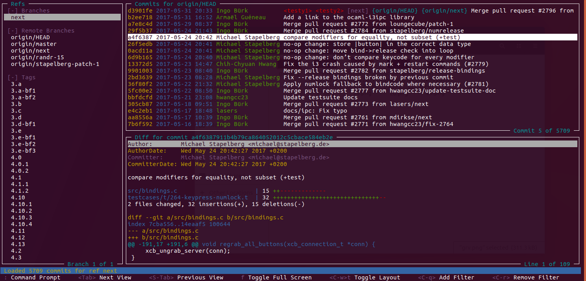

# GRV - Git Repository Viewer 

GRV is a terminal based interface for viewing git repositories. It allows
refs, commits and diffs to be viewed, searched and filtered. The behaviour
and style can be customised through configuration. A query language can
be used to filter refs and commits, see the [Documentation](#documentation)
section for more information.

GRV is currently under development and not feature complete.

## Screenshot

## Documentation

Documentation for GRV is available [here](doc/documentation.md)

## Build instructions

**Coming soon**
